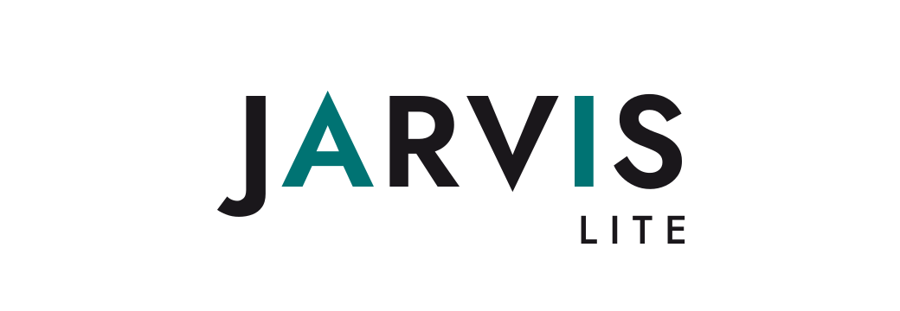
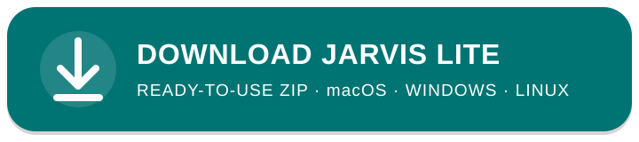

# Jarvis Lite

<p align="center">
  
</p>

**Your personal AI assistant. Easy to start. Yours to evolve.**

Jarvis Lite turns a compatible AI agent into a personal assistant that
remembers who you are, how you work, what matters to you, and where you left
off.

It helps you organize ideas, decisions, tasks, and knowledge; keeps continuity
across sessions; and creates safe local restore points. Everything lives in
readable Markdown files you own and can change at any time.

Download the ready-to-use ZIP, open the folder in Codex, Claude Code, OpenCode,
or another compatible AI agent, and say `Start Jarvis`. Jarvis gets to know you
one step at a time and shapes the workspace around your real needs.

<p align="center">
  <a href="https://github.com/Erionis/Jarvis-Lite/releases/latest/download/Jarvis-Lite.zip">
    
  </a>
</p>

> [!IMPORTANT]
> **Open the complete `Jarvis-Lite` folder in your AI runtime.** Jarvis lives in
> this workspace: if Codex, Claude, or another agent is opened in a different
> folder, it cannot load your Jarvis identity, memory, instructions, or
> continuity. That is a normal AI session—not Jarvis.

## Is it for you?

Jarvis Lite is a good fit if you want:

- a personal assistant that remembers your context and picks up where you left off;
- your notes, decisions, and tasks as plain Markdown you own and can edit anywhere;
- to start with almost no structure and add it only when a real need appears.

It is not a hosted service, a sync or backup system, an AI model, or a fixed
project template — and not a standalone app: you use it through Codex, Claude
Code, OpenCode, or another compatible agent runtime.

## Download and start

The release ZIP is the simplest path. You do not need Git or Python to get the
workspace:

1. Download `Jarvis-Lite.zip` from the latest published release using the
   button above.
2. Extract the ZIP into a new location. Keep the complete `Jarvis-Lite` folder;
   do not merge it into an existing workspace.
3. Open that folder in Codex, Claude Code, OpenCode, or another compatible agent
   runtime, and set the extracted `Jarvis-Lite` folder as the working folder —
   in the Claude desktop app with the **working directory** button, in the Codex
   desktop app as its **workspace**.
4. Say `Start Jarvis` in your language.

> [!NOTE]
> **You do not need Git to start.** If you want to install it beforehand, use
> the official guide for [macOS](https://git-scm.com/install/mac) or
> [Windows](https://git-scm.com/install/windows). Otherwise, let Jarvis handle
> it during first run: it checks whether Git is available, explains how Git
> enables local restore points, and asks before attempting the official
> installation for your operating system.

The button resolves to the latest published release. The
[release page](https://github.com/Erionis/Jarvis-Lite/releases/latest) also
provides `Jarvis-Lite.zip.sha256` for an optional integrity check.

### Build from source

Contributors and technical users can build the same workspace locally with Git
and Python 3:

```bash
git clone https://github.com/Erionis/Jarvis-Lite.git
cd Jarvis-Lite
python3 scripts/build_starter.py --output dist
```

Open `dist/Jarvis-Lite/` in your agent. On Windows, use `py -3` when that is the
installed Python launcher.

See [Get started with Jarvis Lite](docs/getting-started.md) for both acquisition
paths, the exact staged workspace tree, and the four first-run decisions.

## Already have a Jarvis?

If you already run a Jarvis from before Lite, don't unzip this over it and don't
run an incremental update against it. Instead, **adopt** the pieces you want from
a published Lite release — a one-time, review-each-change process that leaves
your workspace intact.

1. Open your existing Jarvis folder in your agent (Codex, Claude Code, OpenCode,
   or another compatible runtime).
2. Use the latest published release as your source: the
   [latest release](https://github.com/Erionis/Jarvis-Lite/releases/latest). It
   is a fixed, verifiable snapshot, so what you review is exactly what you adopt.
3. Ask it to adopt the useful capabilities from that release. Jarvis proposes
   what to take, shows how each item is classified, and asks you to approve every
   change.

Your workspace stays yours: identity, memory, Diary, handoffs, Inbox, local
extensions, and Git history are never overwritten — at most Jarvis asks to *keep
and adapt* where something overlaps.

See [Updates and adoption](docs/updates.md) for the full `adopt-capability`
walkthrough and its boundaries.

## What appears in the workspace

```text
Jarvis-Lite/
├── 00 - Inbox/       material without a confirmed destination
├── 01 - Diary/       curated daily history
├── 99 - Jarvis/      memory, continuity, and system support
├── CLAUDE.md         local context and capability map
└── To Do.md          current and near-future work
```

Runtime and update support also live in hidden package directories. First run
adds Identity and Archive; optional domain folders appear only when explicitly
approved. The [getting-started guide](docs/getting-started.md) shows the complete
pre- and post-first-run shape.

## A day with Jarvis

You can talk to Jarvis in plain sentences; slash aliases are optional (see
[daily use](docs/daily-use.md)).

A quick example. You open the workspace and say:

> **You:** Give me a briefing.
>
> **Jarvis:** Two open items in *Future work*, and an active handoff on the
> pricing note. Nothing new in Inbox. I'd resume the pricing note — that's where
> you stopped yesterday. That, or the open items first?

Everything Jarvis reads and writes is a Markdown file you can open yourself.

| You say | Jarvis does | Local sources that may change |
| --- | --- | --- |
| “Give me a briefing.” | Reads declared evidence and recommends one grounded focus. | None; briefing is read-only. |
| “Work on this decision note.” | Resolves and edits the task's authoritative source. | Only the named or confirmed task source. |
| “Remember this preference.” | Classifies it, previews the exact change, and waits for approval. | None before confirmation; then only the approved Identity or Durable memory patch. |
| “Save and close.” | Records the result, future work, involved handoff, and available local restore point in the defined order. | Confirmed session sources and local Git history when available. |
| “Create a handoff.” | Creates or updates one living continuation record. | Only the selected handoff; listing remains read-only. |

The [daily-use guide](docs/daily-use.md) explains the full start, work, close,
handoff, and diagnostic journey.

## Recommended setup

Jarvis Lite works with different compatible agents, but the quality of its
memory, continuity, and multi-step work depends heavily on the model and
reasoning level you choose.

For the intended Jarvis experience:

- Run a desktop app in its coding mode: the
  [Claude desktop app](https://claude.com/download) in **Code** mode, or the
  [Codex desktop app](https://learn.chatgpt.com/codex/app) in **Codex** mode —
  the mode that opens your workspace folder and runs multi-step work. Both links
  are the official app downloads.
- Use Claude Opus 5 with **High** reasoning, or Codex with **High** reasoning.
  Lighter configurations may work, but can be less consistent on long,
  context-heavy, or multi-step tasks.
- In Claude Code, select **Auto mode** when working in a trusted workspace. In
  the CLI, press `Shift+Tab` until `auto mode on` appears, or start Claude with
  `claude --permission-mode auto`. Auto mode reduces approval interruptions
  while keeping background safety checks.
- Start with “Give me a briefing” and finish meaningful sessions with “Save and
  close” to preserve continuity.
- Keep passwords, API keys, and other secrets outside Markdown files. Use your
  operating system keychain, environment variables, or a secret manager.

## Included and deliberately omitted

The starter includes exactly seven installed skills:

- `briefing` — grounded, read-only session orientation;
- `first-run` — conversational onboarding and a verified local restore point;
- `save-session` — Diary, future-work, handoff, and local-recovery closure;
- `handoff` — living continuity across sessions;
- `jarvis-memory` — preview-first Identity and durable-memory curation;
- `jarvis-doctor` — a read-only contract and readiness audit;
- `jarvis-update` — release-aware updates with scoped recovery.

Inbox organization is normal Jarvis work and needs no separate skill. Lite does
not impose a fixed project hierarchy or silently add optional extensions.
`adopt-capability` remains repository-only for existing non-Lite Jarvis
installations; the public [updates guide](docs/updates.md) explains that
boundary. The [external references](docs/extensions.md) page names optional
projects without treating them as installation, compatibility, or trust
decisions.

## Local-first safety

Identity, memory, work, history, handoffs, Inbox, local extensions, and Git
history remain owned by your workspace. Jarvis previews protected
memory changes and asks before important, destructive, installation, or
external actions. Updates create scoped recovery before changing managed files.

A local restore point supports comparison and recovery; it is not a backup.
Jarvis uses Git behind the scenes for this local history, but does not create an
online repository or publish your files. If Git is missing, Jarvis explains what
it is and asks before trying to install it. Local files do not imply local model
inference: that depends on the runtime and model provider you use.

## Compatibility and prerequisites

The generated package contains physical copies of installed skills in
`.agents/skills/` for Codex and `.claude/skills/` for Claude Code; OpenCode
understands both locations. There are no symlinks, so ordinary ZIP extraction
works across macOS and Windows.

- Markdown/filesystem read and write access is the daily minimum.
- The source builder and update helpers use the Python 3 standard library.
- Git and Python are not required to download or open the release ZIP. Jarvis
  handles local restore-point setup during first run and asks before any system
  installation.

## Building with Jarvis

If you use Jarvis to prototype apps, code, or new products, create a `lab/`
folder and exclude it from the Jarvis workspace Git history:

```text
Jarvis-Lite/
└── lab/                  ignored by the Jarvis workspace repository
    ├── first-project/    its own Git repository
    └── second-project/   its own Git repository
```

Add `/lab/` to the root `.gitignore`, then initialize each project inside it as
an independent Git repository. This keeps Jarvis memory and workspace history
separate from the source code and history of each project.

## Choose your path

| You are | Continue with |
| --- | --- |
| New to Jarvis Lite | [Getting started](docs/getting-started.md) |
| Using Lite day to day | [Daily use](docs/daily-use.md) |
| Updating Lite or bringing a capability to another Jarvis | [Updates and adoption](docs/updates.md) |
| Exploring optional tools | [Extensions and external references](docs/extensions.md) |
| Contributing | [Contribution workflow](CONTRIBUTING.md) |
| Maintaining the repository or acting as a coding agent | [Architecture](docs/architecture.md) and [maintainer guide](AGENTS.md) |

## Development, provenance, and license

Changes follow issue → short-lived branch → pull request → CI → squash merge.
See [CONTRIBUTING.md](CONTRIBUTING.md) for the workflow,
[provenance](docs/provenance.md) for the reuse boundary, and the
[MIT License](LICENSE) for licensing terms.

Brand assets and their minimal usage notes live in
[`assets/brand/`](assets/brand/README.md).
